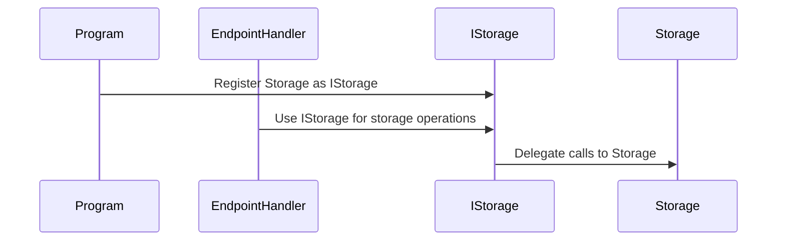
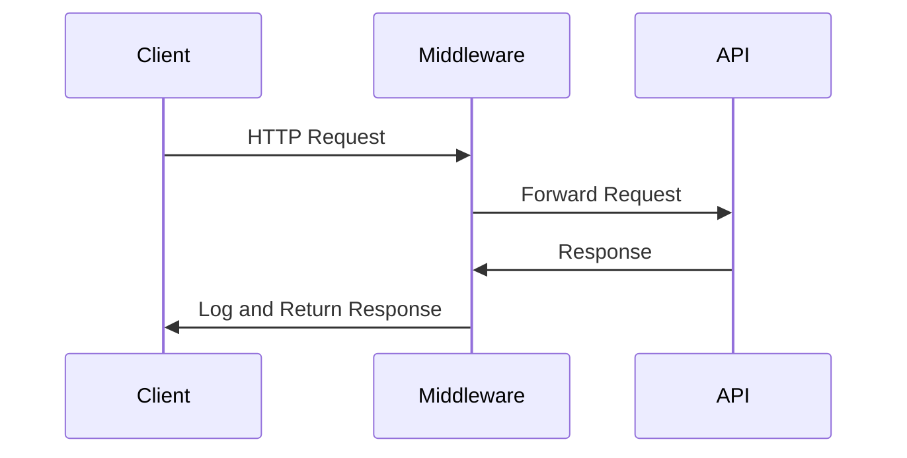

# Assignment 11

## Universal Acceptance Criteria

1. You must understand every single line of your solution.
2. Your code must compile and run without errors.
3. You must submit your repository URL in Brightspace.

## Assignment Requirements

1. **Refactor `Storage` to use Dependency Injection (DI):**
   - Create an interface `IStorage` for the `Storage` class.
   - Update `EndpointHandler` to depend on `IStorage`.
   - Register `Storage` as the implementation of `IStorage` in `Program.cs`.

2. **Introduce Middleware:**
   - Create custom middleware to log HTTP requests and responses.
   - Log the HTTP method, URL, and response status code.
   - Add the middleware to the pipeline in `Program.cs`.

3. **Test the Middleware and DI Setup:**
   - Write unit tests for `EndpointHandler` using `IStorage`.
   - Write integration tests to verify middleware behavior.

## Bonus Requirements

1. Add exception-handling middleware for user-friendly error messages.
2. Write tests for the exception-handling middleware.

---

## What is Middleware?

Middleware processes HTTP requests and responses in the ASP.NET Core pipeline. It enables adding features like logging, authentication, or error handling.

**Why Middleware?**
- **Separation of Concerns:** Keeps logic clean by isolating cross-cutting concerns.
- **Reusability:** Middleware can be shared across projects.
- **Flexibility:** Customize the request/response pipeline.

**Use Case:**
Let's say you want to log every request and response in your app for debugging purposes. How could you do this with the least complexity? Middleware solves this by allowing you to intercept requests and responses in one place.

**Example:**
```csharp
public class LoggingMiddleware
{
    private readonly RequestDelegate _next;

    public LoggingMiddleware(RequestDelegate next) => _next = next;

    public async Task InvokeAsync(HttpContext context)
    {
        Console.WriteLine($"Request: {context.Request.Method} {context.Request.Path}");
        await _next(context);
        Console.WriteLine($"Response: {context.Response.StatusCode}");
    }
}
```

---

## What is Dependency Injection?

Dependency Injection (DI) supplies dependencies to a class from the outside, improving modularity and testability.

**Why DI?**
- **Testability:** Enables mocking dependencies for unit tests.
- **Modularity:** Promotes loose coupling between components.
- **Flexibility:** Swap implementations without changing dependent classes.

**Use Case:**
Let's say your app has to use a `Storage` class to manage data, but you also want to replace it with a mock for testing. How could you do this without rewriting your code? DI solves this by allowing you to inject `Storage` or a mock implementation as needed.

**Example:**
```csharp
public interface IStorage
{
    int[] ListAccounts();
    Account AddAccount();
    Account? GetAccount(int id);
    void RemoveAccount(int id);
}

public class Storage : IStorage
{
    // ...existing code...
}

// Register in Program.cs
builder.Services.AddSingleton<IStorage, Storage>();
```

---

## Steps to Implement

### Dependency Injection (DI)

1. Define `IStorage` for the `Storage` class.
2. Update `EndpointHandler` to use `IStorage`.
3. Register `Storage` as `IStorage` in `Program.cs`.

### Middleware

1. Create a middleware class to log HTTP requests and responses.
2. Use `HttpContext` to access request/response details.
3. Call the next middleware using `await _next(context)`.

---

## Example Workflows

#### **Dependency Injection**



#### **Middleware**



---

## Running and Debugging Tests

Use the C# Dev Kit **Unit Test Runner** and **Code Coverage** button. If tests fail, try:

```bash
dotnet clean
dotnet build
dotnet test --collect:"Coverage"
```

Restart VS Code if issues persist.

