# Assignment 10

## Universal Acceptance Criteria

These criteria apply to all assignments, regardless of specific requirements:

1. You must understand every single line of your solution.
2. Your code must compile and run without errors.
3. You must submit your repository URL in Brightspace.

## Assignment Requirements

1. Implement `EndpointHandler.cs`.
    - Look for `NotImplementedException` and replace that with your correct code.
2. Write tests in `EndpointHandlerTests.cs`.
    - Ensure all tests pass.
    - Achieve at least `80%` code coverage.
3. Implement API endpoints in `Program.cs` according to the specification below.
    - Look for `NotImplementedException` and replace that with your correct code.
4. Write tests in `MinimalApiTests.cs`.
    - Ensure all tests pass.
    - Achieve at least `80%` code coverage.

## Bonus Requirements

1. Improve `EndpointHandlerTests.cs` to achieve at least `95%` code coverage.

## Information

### Class Diagram of `Bank.API`

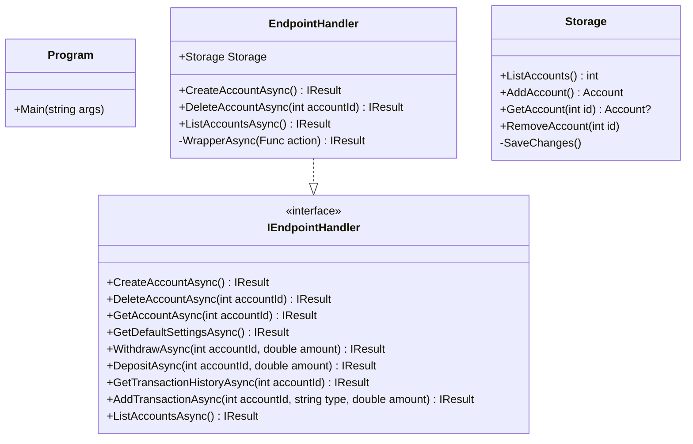

### API Endpoints

Use the existing endpoints as a guide and pattern to follow. This means using `EndpointHandler` and inside `EndpointHandler` methods, copy the patterns already there illustrating how to do this correctly.

#### **Create an account** → `POST /account`

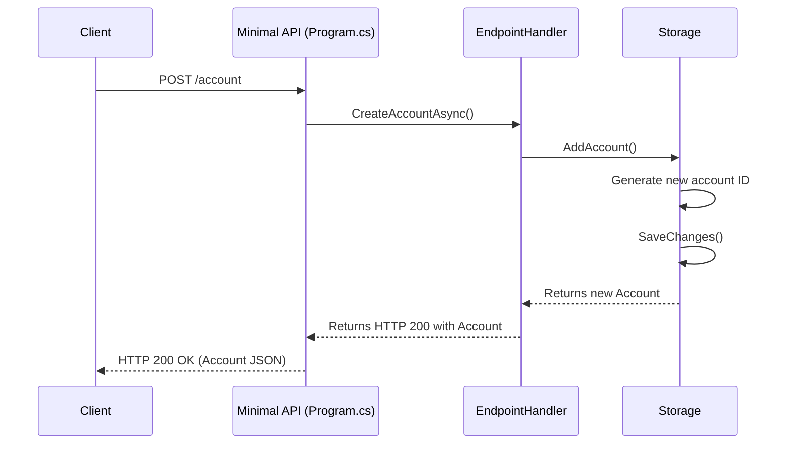

Creates a new account with the specified settings.
```csharp
var client = new HttpClient();
var url = "https://api.example.com/account";
var payload = new Account { Id = 123, Settings = new AccountSettings { OverdraftFee = 25.00 } };
var response = await client.PostAsJsonAsync(url, payload);
```

#### **Get account details** → `GET /account/{accountId}`

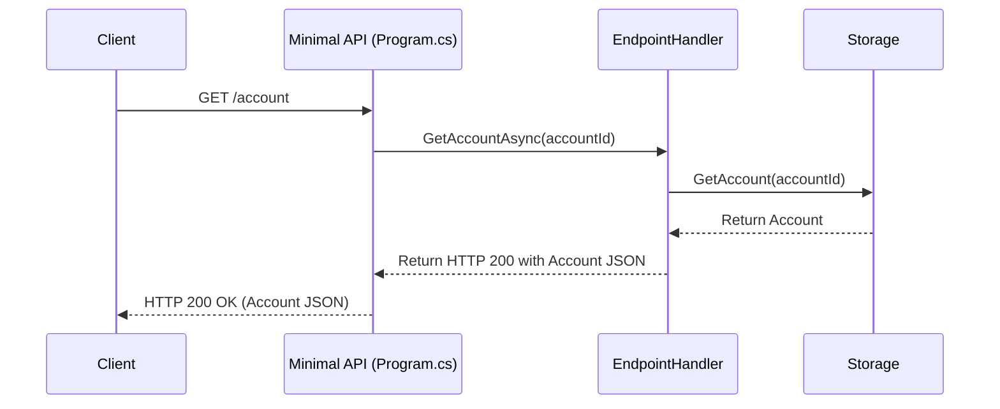
##### Endpoint Workflow


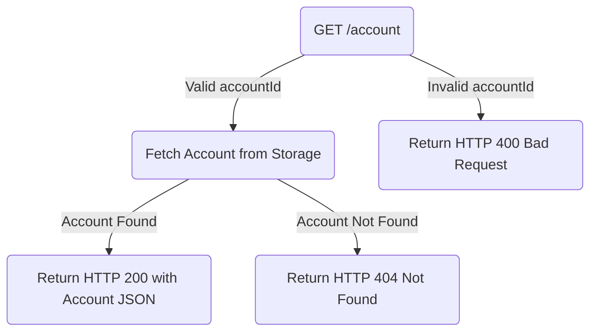

Retrieves details for the specified account.
```csharp
var client = new HttpClient();
var url = "https://api.example.com/account/123";
var response = await client.GetAsync(url);
var account = await response.Content.ReadFromJsonAsync<Account>();
```

#### **Withdraw funds** → `POST /withdraw/{accountId}/{amount}`

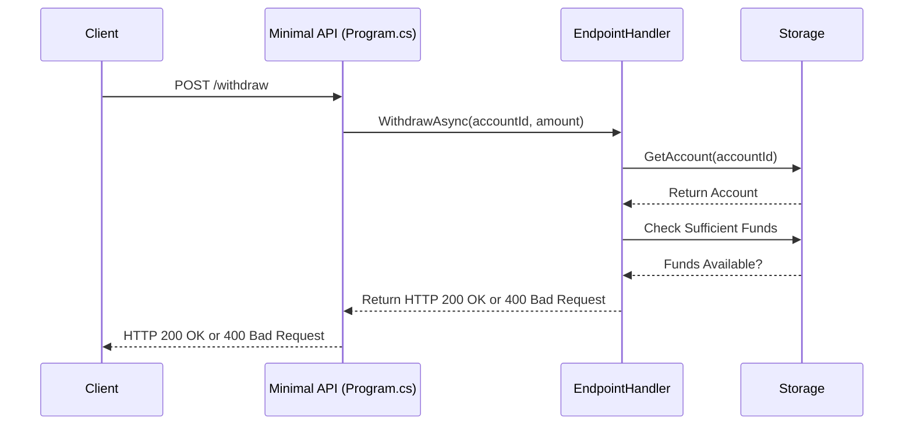
##### Endpoint Workflow


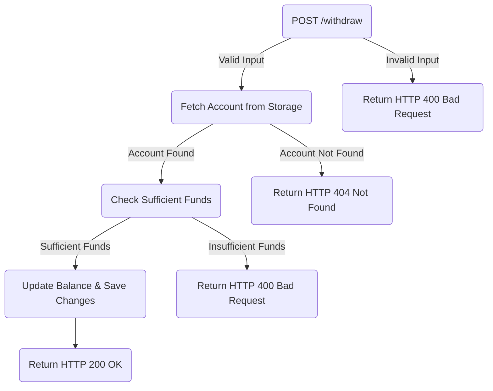

Withdraws a specified amount from an account if funds allow.
```csharp
var client = new HttpClient();
var url = "https://api.example.com/withdraw/123/50.00";
var payload = new Transaction { Id = 123, Type = TransactionType.Withdraw, Amount = 50.00 };
var response = await client.PostAsJsonAsync(url, payload);
```

#### **Deposit funds** → `POST /deposit/{accountId}/{amount}`

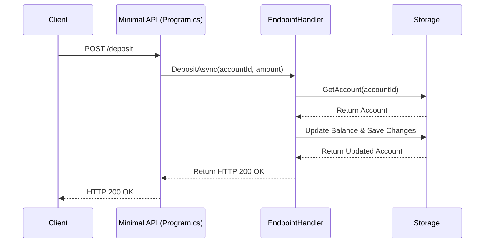
##### Endpoint Workflow


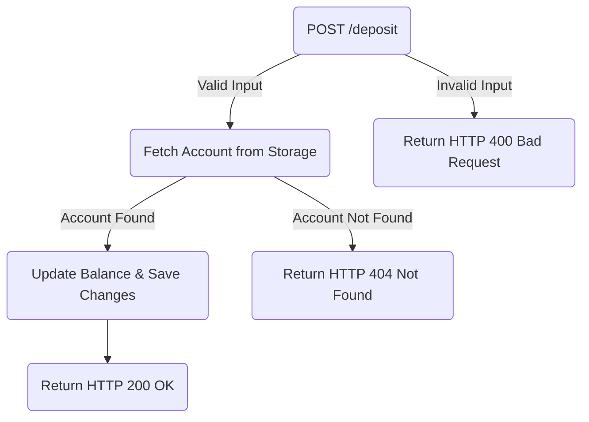

Deposits a specified amount into an account.
```csharp
var client = new HttpClient();
var url = "https://api.example.com/deposit/123/100.00";
var payload = new Transaction { Id = 123, Type = TransactionType.Deposit, Amount = 100.00 };
var response = await client.PostAsJsonAsync(url, payload);
```

#### **Get transaction history** → `GET /transactions/{accountId}`

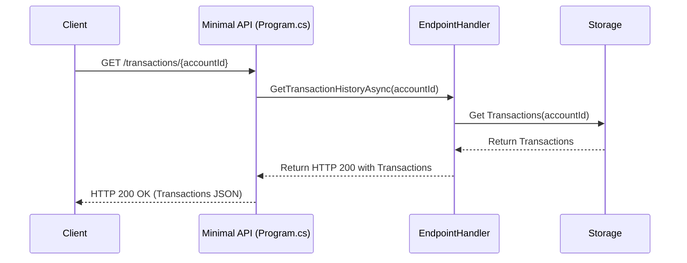
##### Endpoint Workflow

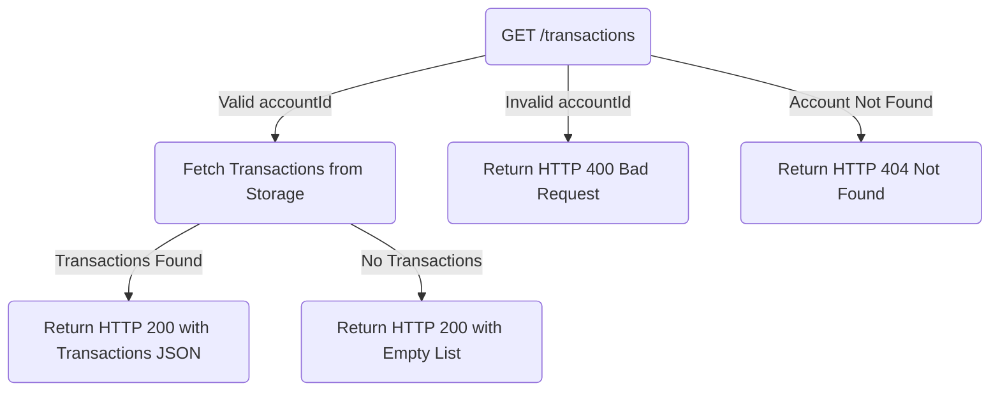

Retrieves a list of transactions for an account.
```csharp
var client = new HttpClient();
var url = "https://api.example.com/transactions/123";
var response = await client.GetAsync(url);
var transactions = await response.Content.ReadFromJsonAsync<List<Transaction>>();
```

#### **Add a specialty transaction** → `POST /transaction/{accountId}/{type}/{amount}`

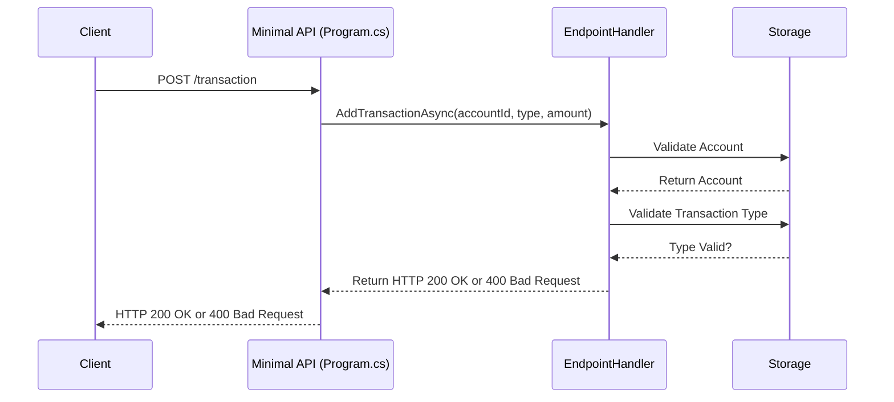
##### Endpoint Workflow

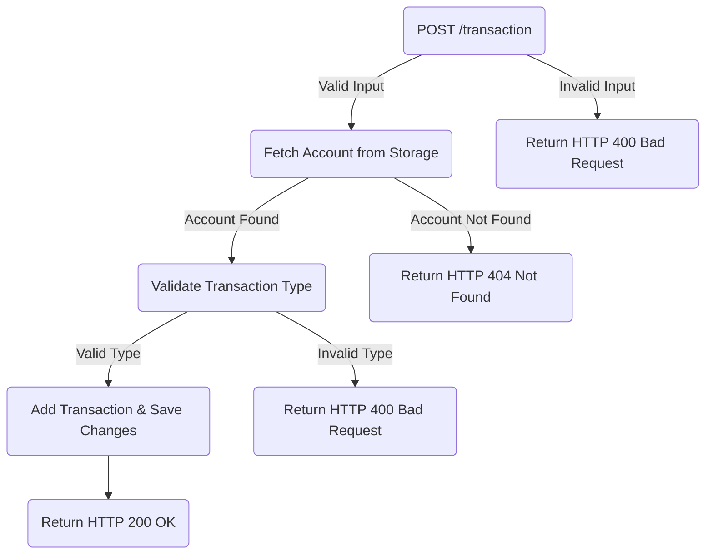

Adds a transaction type (e.g., overdraft fee or interest) to an account.
```csharp
var client = new HttpClient();
var url = "https://api.example.com/transaction/123/Fee_Overdraft/15.00";
var payload = new Transaction { Id = 123, Type = TransactionType.Fee_Overdraft, Amount = 15.00 };
var response = await client.PostAsJsonAsync(url, payload);
```

## Running and Debugging Tests

To verify your implementation, use the C# Dev Kit **Unit Test Runner** and **Code Coverage** button. If tests do not run correctly, try these steps:

```bash
dotnet clean
dotnet build
dotnet test --collect:"Coverage"
```

If issues persist, restart VS Code and ensure your dependencies are installed correctly.

