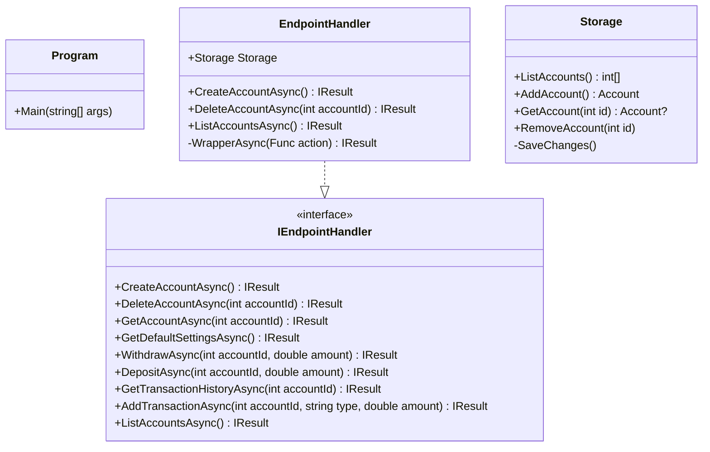
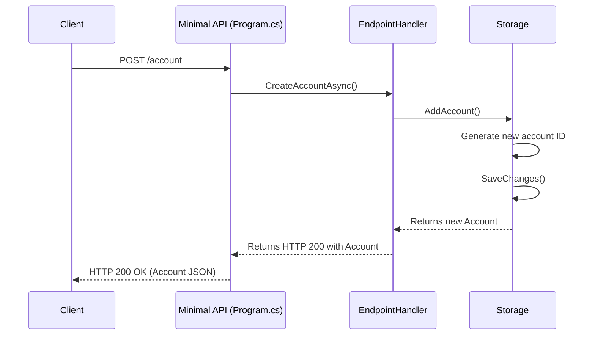

Here’s the updated file without the solution to the assignment:

# Assignment 10

## Universal Acceptance Criteria

This represents acceptance criteria that is true irrespective of assignment criteria.

1. You must understand every single line of your solution.
2. Your code must compile and run without errors.
3. You must turn in your repository URL in Brightspace.

## Assignment Acceptance Criteria

1. Implement `EndpointHandler.cs`
1. Write tests in `EndpointHandlerTests.cs`.
    - Ensure all test pass.
    - Ensure a minimum of `80%` code coverage.
1. Implement `Program.cs` endpoints per spec (below).
1. Write test in `MinimalApiTests.cs`.
    - Ensure all test pass.
    - Ensure a minimum of `80%` code coverage.

## Bonus Acceptance Criteria

1. Update `EndpointHandlerTests.cs`
    - Ensure a minimum of `95%` code coverage.

## Information

### Class diagram of `Bank.API`



### General workflow



### API Specification

**Create an account** → `POST /account`  
*Creates a new account with the specified settings.*  
```csharp
var client = new HttpClient();
var url = "https://api.example.com/account";
var payload = new Account { Id = 123, Settings = new AccountSettings { OverdraftFee = 25.00 } };
var response = await client.PostAsJsonAsync(url, payload);
```

**Get account details** → `GET /account/{accountId}`  
*Retrieves account details for the given account ID.*  
```csharp
var client = new HttpClient();
var url = "https://api.example.com/account/123";
var response = await client.GetAsync(url);
var account = await response.Content.ReadFromJsonAsync<Account>();
```

**Get default account settings** → `GET /account/default-settings`  
*Returns the default settings used for new accounts.*  
```csharp
var client = new HttpClient();
var url = "https://api.example.com/account/default-settings";
var response = await client.GetAsync(url);
var settings = await response.Content.ReadFromJsonAsync<AccountSettings>();
```

**Withdraw funds** → `POST /withdraw/{accountId}/{amount}`  
*Withdraws the specified amount from the given account if funds allow.*  
```csharp
var client = new HttpClient();
var url = "https://api.example.com/withdraw/123/50.00";
var payload = new Transaction { Id = 123, Type = TransactionType.Withdraw, Amount = 50.00 };
var response = await client.PostAsJsonAsync(url, payload);
```

**Deposit funds** → `POST /deposit/{accountId}/{amount}`  
*Deposits the specified amount into the given account.*  
```csharp
var client = new HttpClient();
var url = "https://api.example.com/deposit/123/100.00";
var payload = new Transaction { Id = 123, Type = TransactionType.Deposit, Amount = 100.00 };
var response = await client.PostAsJsonAsync(url, payload);
```

**Get transaction history** → `GET /transactions/{accountId}`  
*Retrieves a list of transactions for the specified account.*  
```csharp
var client = new HttpClient();
var url = "https://api.example.com/transactions/123";
var response = await client.GetAsync(url);
var transactions = await response.Content.ReadFromJsonAsync<List<Transaction>>();
```

**Add specialty transaction** → `POST /transaction/{accountId}/{type}/{amount}`  
*Adds a specific transaction type, such as an overdraft fee or interest, to an account.*  
```csharp
var client = new HttpClient();
var url = "https://api.example.com/transaction/123/Fee_Overdraft/15.00";
var payload = new Transaction { Id = 123, Type = TransactionType.Fee_Overdraft, Amount = 15.00 };
var response = await client.PostAsJsonAsync(url, payload);
```